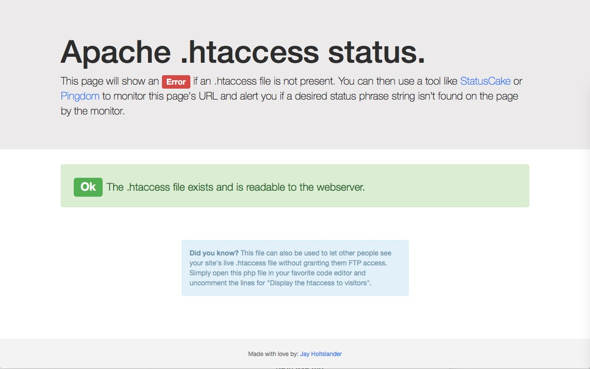
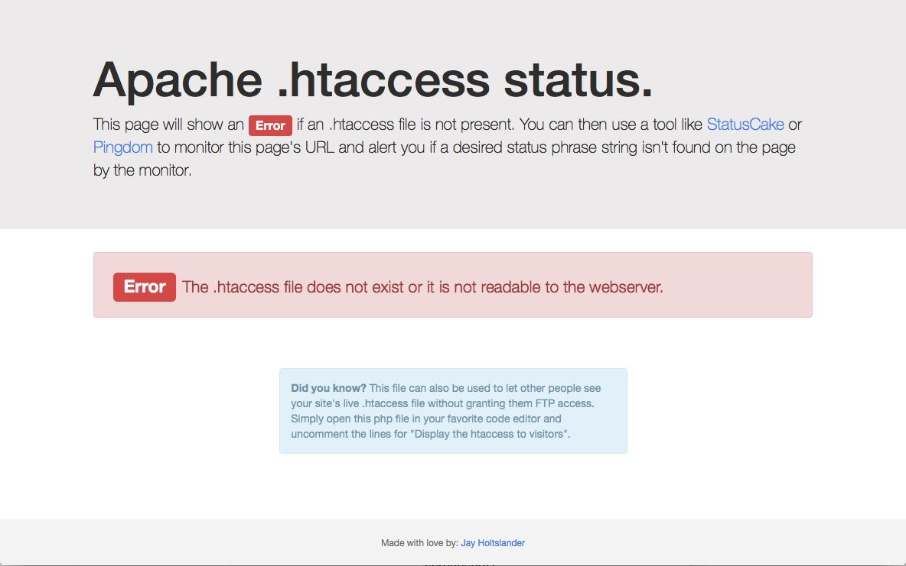
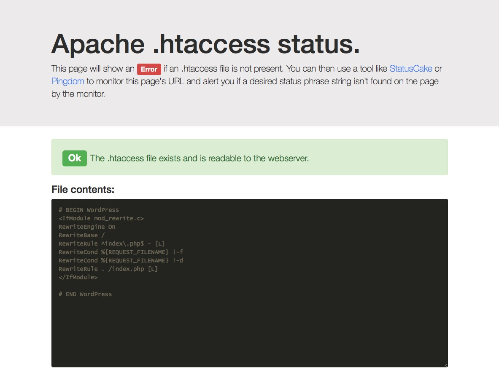

# Apache-htaccess-Status-Page
Prevent accidents or problems by automatically monitoring your website's .htaccess file.

This page will show an error if an .htaccess file is not present. You can then use a tool like [StatusCake](https://www.statuscake.com/) or [Pingdom](https://www.pingdom.com/) to monitor this page's URL and alert you if a desired status phrase string isn't found on the page by the monitor.

**eg:** Alert me if the string "*file exists*" is not found. or alert me if the string "*does not exist*" is found.

## Installation
1. Upload the file htaccess.php to your website's root folder
2. Visit the page at [yourwebsite.com]/htaccess.php

## Extra bonus
This file includes a way to display  the live .htaccess file to page visitors. Uncomment lines 47-50 to enable this feature.

## Screenshots

